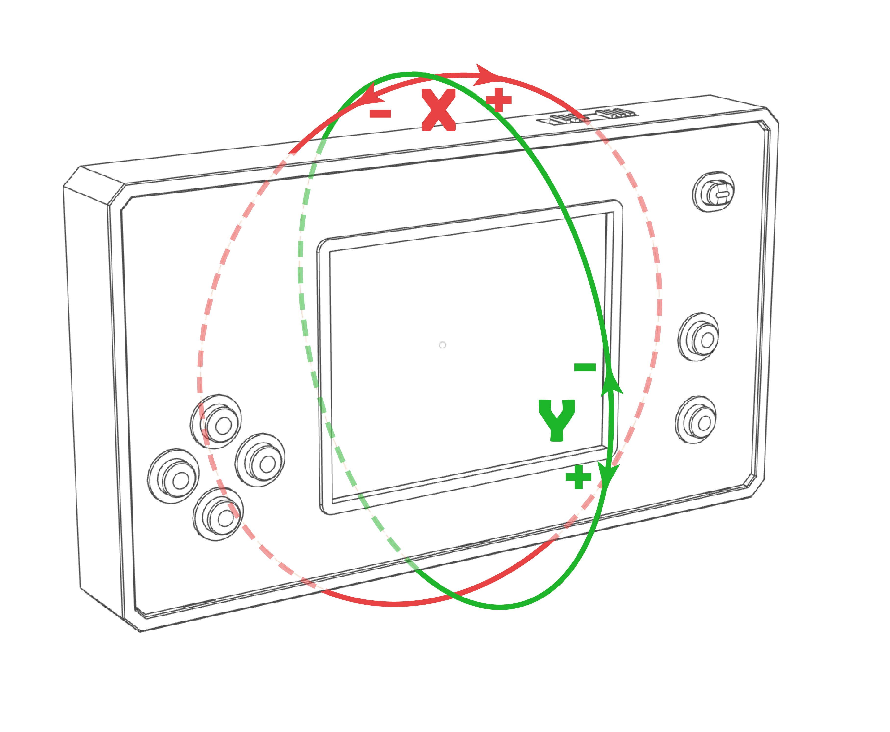

#####################
Accelerometer
#####################

.. contents::
    :local:
    :depth: 2

Overview
-----------------

The gamepad features a **3-axis accelerometer**, which can be used to measure acceleration and, more commonly, the **inclination angles of the gamepad**. The accelerometer is accessed through the ``gamepad.accel`` instance.

The gamepad's incline is measured along the X (roll) and Y (pitch) axes, relative to the :ref:`zero orientation <operation_mode>`.

.. note::
    The positive direction of both axes corresponds to the positive direction on the display.

.. _accel_axes_img:

   Axes positions in respect to accelerometer zero

.. _operation_mode:

Operation Modes (Zero Orientation)
-------------------------------------

The accelerometer supports two operation modes:

- **Vertical mode** (default)
- **Horizontal mode**

Use :cpp:func:`Gamepad_accel::set_vertical_mode` to set the gamepad as zero when held vertically by hand.

Use :cpp:func:`Gamepad_accel::set_horizontal_mode` to set the gamepad as zero when placed parallel to the ground.

See the images below for clarity. The grid on the images represents the ground plane.

.. hlist::
   :columns: 2

   * .. figure:: horizontal_mode.png
        :alt: Horizontal mode
        :width: 100%
        :align: center

        Horizontal mode

   * .. figure:: vertical_mode.png
        :alt: Vertical mode
        :width: 100%
        :align: center

        Vertical mode

.. note::
    It is not recommended to use any operation mode where the angle can reach :math:`90^\circ` due to high measurement instability.

Custom zero orientation
^^^^^^^^^^^^^^^^^^^^^^^^^^^^^^^^^^^^^

Any orientation can be set as the zero orientation using :cpp:func:`Gamepad_accel::set_current_as_zero`. This is useful for adapting to the player's holding style. The function also allows **blocking the X (roll) axis** to maintain a stable horizontal reference in some games.

Common examples
^^^^^^^^^^^^^^^^^^

.. code-block:: cpp

    void game_settings(){
        // ...
        if(/* pressed "calibrate gyro" */)
            gamepad.accel.set_current_as_zero();
        
        if(/* set defaults */)
            gamepad.accel.set_vertical_mode();
    }

Read incline angles
-----------------------
.. TODO: add reference to vec2

The function :cpp:func:`Gamepad_accel::get_angles` returns a ``vec2`` object containing the **X incline** in ``vec.x`` and **Y incline** in ``vec.y``. Angles are measured relative to the :ref:`zero orientation <operation_mode>`. Axis directions are illustrated in :ref:`figure <accel_axes_img>`.

Angles can also be calculated from a ``vec3`` acceleration vector.

Common examples
^^^^^^^^^^^^^^^^^^

.. code-block:: cpp

    vec2 pos(DISP_WIDTH / 2, DISP_HEIGHT / 2);
    vec2 vel;
    uint64_t last_update = 0;

    void setup(){
        gamepad.init(gyro_demo);

        // Display represents the "ground" plane
        gamepad.accel.set_horizontal_mode();
        gamepad.main_loop();
    }

    void gyro_demo(){
        // Erase previous frame
        gamepad.canvas -> fillCircle(pos.x, pos.y, R, TFT_BLACK);

        // Get accelerometer data
        vec2 ang = gamepad.accel.get_angles() * (1 / 180.0);

        // Recalculate position
        vel += ang * 30;
        vel -= vel.norm() * (20 * (millis() - last_update) / 1000.0);
        pos += vel * ((millis() - last_update) / 1000.0);
        last_update = millis();     // sets time scale

        // Render frame
        gamepad.canvas -> fillCircle(pos.x, pos.y, R, TFT_RED);
        gamepad.update_display();
    }

Read acceleration
-----------------

Raw acceleration can be read using :cpp:func:`Gamepad_accel::get_accel`.

API reference
-----------------

Functions
^^^^^^^^^^^^^^^^

.. doxygenfunction:: Gamepad_accel::set_vertical_mode
.. doxygenfunction:: Gamepad_accel::set_horizontal_mode
.. doxygenfunction:: Gamepad_accel::set_current_as_zero
.. doxygenfunction:: Gamepad_accel::get_angles()
.. doxygenfunction:: Gamepad_accel::get_angles(vec3 &accel)
.. doxygenfunction:: Gamepad_accel::get_accel
.. doxygenfunction:: Gamepad_accel::auto_calibrate