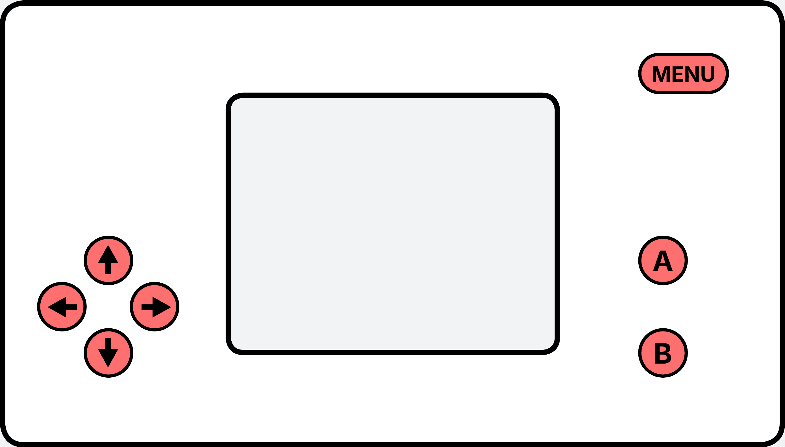

############################
Buttons
############################

.. contents::
    :local:
    :depth: 2

Overview
-------------------

All button interactions are handled by the **DevelDeck-API** using system interrupts. When a button event occurs, it is immediately captured by the interrupt handler and stored in an internal event queue.

Events remain in the queue until they are requested by the API user. This ensures that no button interactions are lost, even if multiple events occur between successive API calls.

Buttons functionality have to be accessed through ``ddeck.buttons`` instance.

IDs
^^^^^^^^^^^^

Each button is assigned a unique ID. The buttons are enumerated using the following keywords:

- ``LEFT_BUT_ID``
- ``UP_BUT_ID``
- ``RIGHT_BUT_ID``
- ``DOWN_BUT_ID``
- ``A_BUT_ID``
- ``B_BUT_ID``
- ``MENU_BUT_ID``

   Button layout on the DevelDeck

Possible states
^^^^^^^^^^^^^^^^^^^

Each button can be in one of the following states:

- ``BUT_NONE`` - Neutral state; no event has been recorded.
- ``BUT_PRESSED``  - A button press event has been detected.
- ``BUT_RELEASED`` - A button release event has been detected.
- ``BUT_STILL_PRESSED`` - The button remains pressed; no state change since the previous event.
- ``BUT_STILL_RELEASED`` - The button remains released; no state change since the previous event.

The states ``BUT_PRESSED`` and ``BUT_RELEASED`` are typically used to detect player “click” interactions. **BUT_STILL_PRESSED** and **BUT_STILL_RELEASED** are used to detect that the button is hold, while player "click" on other buttons.

Event handling
-------------------

To determine whether there are unprocessed button events in the queue, use
:cpp:func:`DD_buttons::event_available`.

Event data can be retrieved using :cpp:func:`DD_buttons::get_event`.
This function returns a ``uint8_t*`` pointer to an array containing
``BUTTONS_N`` (7) elements. Each element represents the state of a button,
indexed by its corresponding button ID.

After :cpp:func:`DD_buttons::get_event` is called, the event is considered handled and
is removed from the queue.

.. important::
   Calling :cpp:func:`DD_buttons::event_available` before :cpp:func:`DD_buttons::get_event` is **mandatory**. If the queue is empty, :cpp:func:`DD_buttons::event_available` returns ``nullptr``. Dereferencing this pointer will cause an ESP32 **Guru Meditation Error**.

It is implied to read and process all button events while events are available.

Force-clearing queue
^^^^^^^^^^^^^^^^^^^^^^^^

If necessary, the event queue can be **emptied forcibly** using the
:cpp:func:`DD_buttons::clear_queue` function.

This can be useful in scenarios such as:

- Resetting the game state
- Ignoring accumulated button presses during initialization

Common examples
^^^^^^^^^^^^^^^^^^

.. code-block:: cpp

   void loop(){

      // Process all button events since the previous loop iteration
      while(ddeck.buttons.event_available()){
         // Get button event (array indexed by button IDs)
         uint8_t *event = ddeck.buttons.get_event();
         

         // Perform jump only on button press (click)
         if(event[UP_BUT_ID] == BUT_PRESSED){      // Read event state by button ID
               Serial.println("UP pressed")
               // Handle player jump
         }
         
         // Move player on press or hold
         if(event[RIGHT_BUT_ID] == BUT_PRESSED || event[RIGHT_BUT_ID] == BUT_STILL_PRESSED){
               Serial.println("RIGHT pressed");
               // Player going right
         }
         if(event[LEFT_BUT_ID] == BUT_PRESSED || event[LEFT_BUT_ID] == BUT_STILL_PRESSED){
               Serial.println("RIGHT pressed");
               // Player going left
         }

         // Call main menu
         if(event[MENU_BUT_ID] == BUT_PRESSED)
               ddeck.main_menu();
      }

      // ...
      // Main game logic
   }

Direct state read
------------------

Button state can be retrieved directly by using :cpp:func:`DD_buttons::read_state`. This function will return **current** button state by its ID.

Latest (in time) queue event can be accessed using :cpp:func:`DD_buttons::get_latest_state` without scanning all events and marking them as handled.

Common examples
^^^^^^^^^^^^^^^^^^

.. code-block:: cpp

   if(ddeck.buttons.read_state(A_BUT_ID))
      Serial.println("A is pressed now");
   else
      Serial.println("A is unpressed now");

.. code-block:: cpp

   void some_func(){
      // ...
      ddeck.buttons.clear_queue();
   }

   void loop(){
      some_func();
      /// ...
      uint8_t *initial_A_state = ddeck.buttons.get_latest_state(A_BUT_ID);
      /// ...
   }

API reference
-----------------

Functions
^^^^^^^^^^^^^^^^

.. doxygenfunction:: DD_buttons::event_available
.. doxygenfunction:: DD_buttons::get_event
.. doxygenfunction:: DD_buttons::add_button_event
.. doxygenfunction:: DD_buttons::clear_queue
.. doxygenfunction:: DD_buttons::read_state
.. doxygenfunction:: DD_buttons::get_latest_state

Enumerations
^^^^^^^^^^^^^^^^

.. doxygenenum:: Buttons_id_t
.. doxygenenum:: Button_event_t