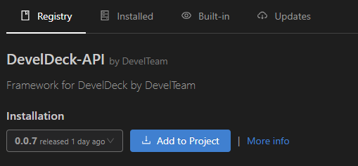
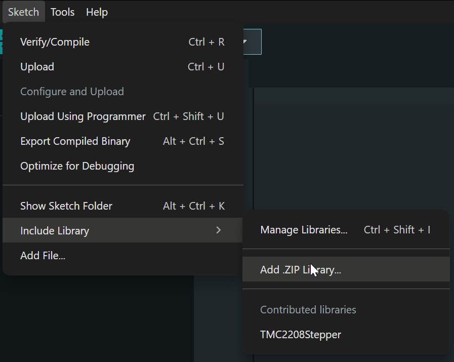

*******************************
API (Library) Installation
*******************************

.. contents::
    :local:
    :depth: 2

PlatformIO
----------------------

Create a project in PlatformIO and select ``Espressif ESP32 Dev Module`` in the board moule. When the project is created you can install the library.

Method 1 - ``platformio.ini``
^^^^^^^^^^^^^^^^^^^^^^^^^^^^^^^^^

Add the library to your project dependencies in ``platformio.ini``:

.. code-block:: ini

    lib_deps =
        spirit1qtr/DevelDeck-API

Method 2 - PlatformIO Library Manager
^^^^^^^^^^^^^^^^^^^^^^^^^^^^^^^^^^^^^^^^^^^^

Open **PlatformIO → Libraries**, search for **DevelDeck-API**, click **"Add to Project"**, and select your project.

|

Arduino IDE
----------------------

1. Install the ESP32 board support
^^^^^^^^^^^^^^^^^^^^^^^^^^^^^^^^^^^^^^^^^^^

To install ESP32 board support in Arduino IDE, follow one of these tutorials: `Arduino IDE <https://randomnerdtutorials.com/installing-the-esp32-board-in-arduino-ide-windows-instructions/>`_, `Arduino IDE 2 <https://randomnerdtutorials.com/installing-esp32-arduino-ide-2-0/>`_ 

.. note::
    DevelDeck-API supports ESP32 Arduino **v3.x**, but it is still strongly recommended to use **v2.x**

.. note::
    Any ESP32 board should work, but use ``ESP32 Dev Module`` board for stability.

2. Download the required libraries
^^^^^^^^^^^^^^^^^^^^^^^^^^^^^^^^^^^^^^^^^^^

Download the following libraries as ``.zip`` files:

- `DevelDeck-API <https://github.com/AlexeysShelyagin/DevelDeckAPI>`_
- `TFT_eSPI (fork for DevelDeck) <https://github.com/AlexeysShelyagin/TFT_eSPI_DevelDeck>`_
- `PNGdec (1.1.6 recommended) <https://github.com/bitbank2/PNGdec>`_

3. Install the libraries in Arduino IDE
^^^^^^^^^^^^^^^^^^^^^^^^^^^^^^^^^^^^^^^^^^^^

For each downloaded library, open Arduino IDE and select: ``Sketch → Include Library → Add .ZIP Library``. Then select the downloaded ``.zip`` file.

|

Including the library
------------------------

Now include the DevelDeck-API in your ``main.cpp`` (PlatformIO) or ``sketch.ino`` (Arduino IDE):

.. code-block:: cpp

    #include <Arduino.h>        // Remove if using Arduino IDE
    #include "DevelDeckAPI.h"

    void setup() {
    }

    void loop() {
    }

You are now ready to start using the API.