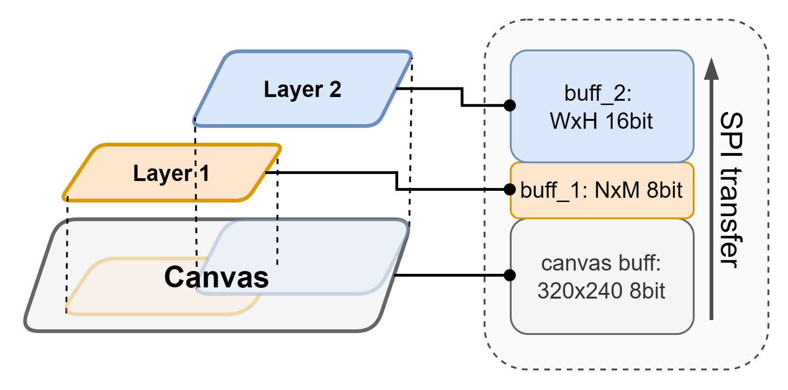
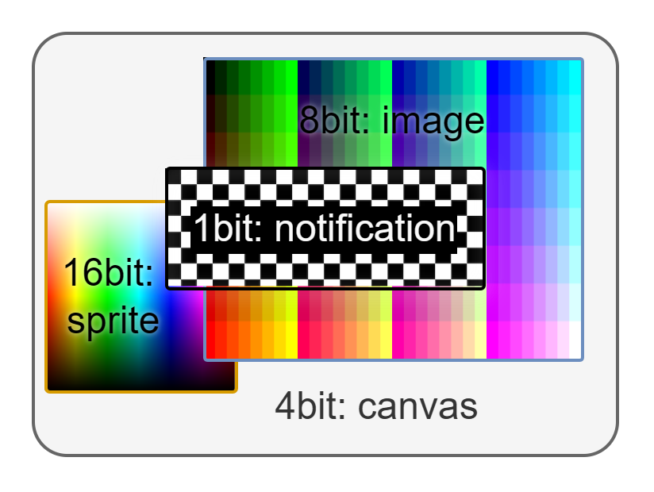
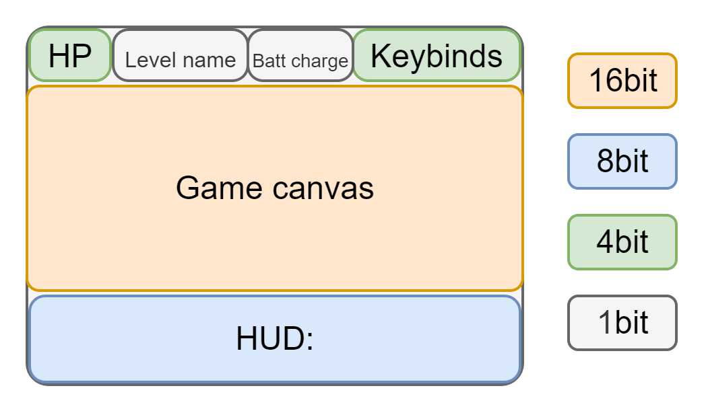

*******************************
Layers
*******************************

.. contents::
    :local:
    :depth: 2

Overview
------------------

The ``gamepad.canvas`` is the **base display buffer**. It represents a fixed ``320x240`` layer that is transferred to the display as a **single block**. Due to its size, the ``gamepad.canvas`` is limited to **8-bit color depth**. Additionally, transferring the entire buffer is relatively slow, which may negatively impact performance in time-sensitive applications.

To address these limitations, **layers** can be used. A layer is an independent ``W × H (1|4|8|16-bit)`` image buffer that is rendered separately from the base canvas.

Layers can be thought of as rectangular **"stamps"** placed onto the display, overwriting previously rendered content. A layer **cannot modify pixels outside its own boundaries**.

.. note::
   Layers do not support transparency.

Layer Manipulation
----------------------

Layer Creation
^^^^^^^^^^^^^^^^^

Use :cpp:func:`Gamepad::create_layer` to create a new layer. You must specify:

- **Width and height**
- **Top-left corner position**
- **Bit depth** (1, 4, 8, or 16 bits)

The function returns a :cpp:type:`Layer_id_t` object, which serves as a reference for the layer in other API calls.

.. warning::
   If there is not enough **contiguous memory** available in the heap, the layer will not be created and therefore will not be rendered.

.. note::
   :cpp:type:`Layer_id_t` internally stores a pointer to its canvas (the same type as ``gamepad.canvas``), allowing direct access:

   ``layer->canvas->print("text");``

Deletion
^^^^^^^^^^^^^

Use :cpp:func:`Gamepad::delete_layer` to remove a layer and free its memory. Any further use of the deleted layer will result in a **memory access error**.

Other Operations
^^^^^^^^^^^^^^^^^^

- Check if a layer exists using :cpp:func:`Gamepad::layer_exists`
- Clear a layer using :cpp:func:`Gamepad::clear_layer` (fills with black)
- Move a layer using :cpp:func:`Gamepad::move_layer`

Rendering
------------------

Layers are rendered **on top of the base canvas in creation order** when using:

- :cpp:func:`Gamepad::update_display`
- :cpp:func:`Gamepad::update_display_threaded`

You can render only the base canvas by setting ``ignore_layers = true``.

Each layer (including the base canvas) is transferred to the display as a **separate data block**. As a result, layers appear on the screen **sequentially**, which may cause **visible flickering** during frequent updates.

   Layers transfer onto display diagram

.. note::
   The final composited image exists **only on the display**. Layers do **not** modify the base canvas or other layers.

.. note::
   Rendering layers via :cpp:func:`Gamepad::update_display` is **not recommended** for performance-sensitive scenarios.

Layer Update
^^^^^^^^^^^^^^^

A single layer can be rendered independently using :cpp:func:`Gamepad::update_layer`.

Threaded Layer Update
^^^^^^^^^^^^^^^^^^^^^^^^

A threaded variant is available: :cpp:func:`Gamepad::update_layer_threaded`.

Refer to :ref:`disp_threaded_update_section` for details.

The function :cpp:func:`Gamepad::update_display_threaded_available` applies to both canvas and layers.

DMA update
^^^^^^^^^^^^^^^

If the **layer bitdepth is** ``16bit`` the **DMA** (Direct Memory Access) transfer is used. This approach is faster than the default one for about ``~15%``. So it is recommended to use 16bit layers for the fps-sensetive graphics.

.. note::
   DMA update **can be disabled** using global flag ``bool ALLOW_DMA = false;``

Common Example
^^^^^^^^^^^^^^^^^^

.. code-block:: cpp

   Layer_id_t layer, notifications;

   void setup() {
      gamepad.clear_canvas();
      gamepad.update_display();

      // create 16-bit layer
      layer = gamepad.create_layer(100, 100, 0, 0, 16);
      // 1-bit layer for notifications
      notifications = gamepad.create_layer(120, 40, 110, 100, 1);

      // Reference layer canvas through function
      gamepad.layer(layer)->print("layer");

      // Access layer canvas directly
      notifications->canvas->drawRect(0, 0, 120, 40, TFT_WHITE);
      notifications->canvas->drawCentreString("B&W notification", 60, 10, 1);
      // In 1-bit non-black is white
      notifications->canvas->fillRect(20, 30, 80, 4, TFT_RED);

      // render notification
      gamepad.update_layer(notifications);

      gamepad.main_loop();
   }

   void loop() {
      // 16bit color gradient
      for(uint16_t y = 0; y < 100; y++){
         for(uint16_t x = 0; x < 100; x++){
               layer->canvas->drawPixel(x, y, (x<<11) ^ (y<<5) ^ (x+y+millis()>>6));
         }
      }

      // delete notification after 5 seconds
      if(gamepad.layer_exists(notifications) && millis() > 5000){
         gamepad.delete_layer(notifications);
         // use empty canvas to remove notification from display
         gamepad.update_display();

         // move layer origin to display center
         gamepad.move_layer(layer, 110, 70);
         // note that previous image would remain on display
         // because no new data is transfered there
      }

      // update only 100x100 16bit layer
      gamepad.update_layer(layer);
   }

Optimization and Best Practices
-----------------------------------

Recommended use cases for layers:

- Temporary UI elements (notifications, dialogs, overlays)
- Screen zoning (HUDs, UI panels)
- Mixing different color depths for efficiency

.. note::
   The base ``gamepad.canvas`` color depth can be reduced (e.g., ``uint8_t CANVAS_COLOR_DEPTH = 1;``) to save memory. The freed memory can then be used for higher-quality layers (e.g., 16-bit).

Using layers with **different bit depths** is encouraged. This improves memory efficiency while enabling richer graphics where needed.

Avoid overlapping layers that are updated frequently, as this can cause **visible flickering**.

   Example of layers with different bit depths

   Optimized layer layout example

Common Issues
^^^^^^^^^^^^^^^^

Potential problems when using layers:

- **Flickering** — caused by sequential rendering of overlapping layers
- **Memory fragmentation** — due to frequent allocation/deallocation
- **Allocation failure** — if no sufficiently large contiguous memory block is available

Because layers are transferred sequentially, overlapping regions may briefly show lower layers before upper ones are drawn. With frequent updates, this results in continuous flickering.

It is **strongly recommended** to:

- Allocate all required layers during initialization
- Avoid runtime creation unless necessary
- Minimize overlapping regions

**Avoid** using layers for:

- Sprite rendering *(flickering issues)*
- Stacked animation effects *(flickering issues)*
- Fullscreen secondary buffers *(memory overhead)*

Layers should be treated as **independent rendering surfaces**, not as compositing or sprite systems.

API Reference
------------------

Functions
^^^^^^^^^^^^

.. doxygenfunction:: Gamepad::create_layer
.. doxygenfunction:: Gamepad::delete_layer
.. doxygenfunction:: Gamepad::layer_exists
.. doxygenfunction:: Gamepad::layer
.. doxygenfunction:: Gamepad::update_layer
.. doxygenfunction:: Gamepad::update_layer_threaded

.. doxygenfunction:: Gamepad::clear_layer
.. doxygenfunction:: Gamepad::move_layer

Datatypes
^^^^^^^^^^^^

.. doxygentypedef:: Layer_id_t